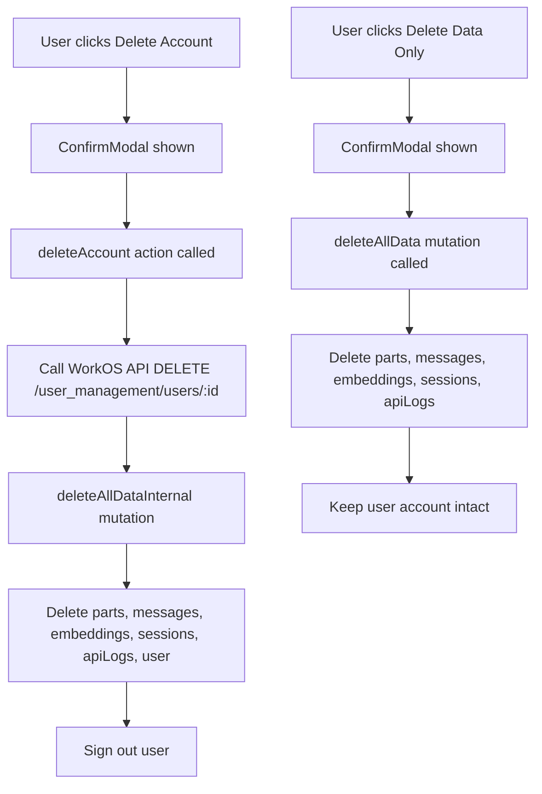

# Account and Data Management Features

## Summary

Implement three features:

1. Allow users to delete their WorkOS account
2. Allow users to delete all their synced data from Convex (only their data)
3. Add a data management trust message on the homepage

---

## 1. Backend: Delete User Data Mutation

Add a new internal mutation in [`convex/users.ts`](convex/users.ts) that deletes all user data.

**Tables to delete from (in order to respect foreign keys):**

- `parts` (via messages)
- `messages` (via sessions)
- `sessionEmbeddings` (by userId)
- `sessions` (by userId)
- `apiLogs` (by userId)
- `users` (the user record itself, optional based on full delete)
```typescript
// convex/users.ts - new mutations
export const deleteAllData = mutation({...})  // Public, keeps account
export const deleteAllDataInternal = internalMutation({...})  // For full account deletion
```


---

## 2. Backend: Delete WorkOS Account Action

Add a new action in [`convex/users.ts`](convex/users.ts) that:

1. Calls the WorkOS API to delete the user: `DELETE /user_management/users/{user_id}`
2. Requires `WORKOS_API_KEY` environment variable
3. Calls `deleteAllDataInternal` to clean up Convex data
```typescript
// convex/users.ts - new action
export const deleteAccount = action({...})
```


**WorkOS API Reference:** The user's WorkOS ID is stored as `workosId` in the users table.

---

## 3. Frontend: Settings Page Danger Zone

Update [`src/pages/Settings.tsx`](src/pages/Settings.tsx) to add a "Danger Zone" section in the Profile tab with:

- **Delete Synced Data** button: Deletes all sessions/messages/embeddings but keeps account
- **Delete Account** button: Deletes WorkOS account and all data permanently

Both require confirmation via the existing `ConfirmModal` component.

---

## 4. Frontend: Homepage Trust Message

Update [`src/pages/Login.tsx`](src/pages/Login.tsx) to add a short message near the feature list about data control:

```
Your data, your control - delete or export anytime
```

---

## File Changes Summary

| File | Changes |

|------|---------|

| `convex/users.ts` | Add `deleteAllData` mutation, `deleteAllDataInternal` internal mutation, `deleteAccount` action |

| `src/pages/Settings.tsx` | Add Danger Zone section with delete data and delete account buttons |

| `src/pages/Login.tsx` | Add trust message about data management |

---

## Environment Variables Required

- `WORKOS_API_KEY` - Already should exist for WorkOS integration (used for deleting user accounts)

---

## Data Flow

