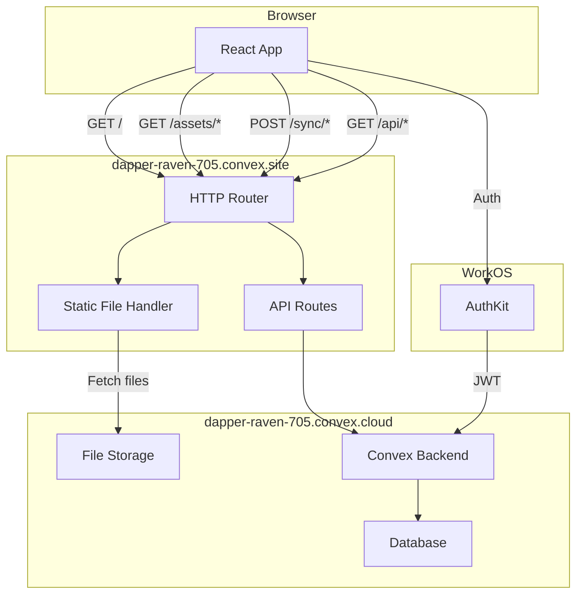

# Convex Self-Static-Hosting Integration Plan

## Overview

This plan integrates Convex's self-static-hosting component to serve your React/Vite frontend directly from `https://dapper-raven-705.convex.site`. Your existing API endpoints and WorkOS authentication will continue working unchanged.

## Architecture



## File Changes Required

### 1. Install the self-static-hosting component

```bash
npm install github:get-convex/self-static-hosting#main
```

### 2. Update [convex/convex.config.ts](convex/convex.config.ts)

Add the self-static-hosting component alongside the existing RAG component:

```typescript
import { defineApp } from "convex/server";
import rag from "@convex-dev/rag/convex.config";
import selfStaticHosting from "@get-convex/self-static-hosting/convex.config.js";

const app = defineApp();
app.use(rag);
app.use(selfStaticHosting);

export default app;
```

### 3. Create new file [convex/staticHosting.ts](convex/staticHosting.ts)

This exposes the internal upload API and deployment query:

```typescript
import { components } from "./_generated/api";
import {
  exposeUploadApi,
  exposeDeploymentQuery,
} from "@get-convex/self-static-hosting";

// Internal functions for upload (only callable via npx convex run)
export const { generateUploadUrl, recordAsset, gcOldAssets, listAssets } =
  exposeUploadApi(components.selfStaticHosting);

// Public query for live reload notifications
export const { getCurrentDeployment } =
  exposeDeploymentQuery(components.selfStaticHosting);
```

### 4. Update [convex/http.ts](convex/http.ts)

Add static file serving at the end of the file, after all API routes:

```typescript
// At the top, add import:
import { registerStaticRoutes } from "@get-convex/self-static-hosting";
import { components } from "./_generated/api";

// At the END of the file, before `export default http;`:
// Register static file routes with SPA fallback
// This serves the React app for any GET request not matching API routes
registerStaticRoutes(http, components.selfStaticHosting);

export default http;
```

### 5. Update [src/main.tsx](src/main.tsx)

Auto-detect Convex URL when hosted on convex.site:

```typescript
import { getConvexUrl } from "@get-convex/self-static-hosting";

// Replace the convex client initialization with:
function getConvexClientUrl(): string {
  // Use env var in development, derive from hostname in production
  if (import.meta.env.VITE_CONVEX_URL) {
    return import.meta.env.VITE_CONVEX_URL as string;
  }
  return getConvexUrl();
}

const convex = new ConvexReactClient(getConvexClientUrl());
```

### 6. Update [vite.config.ts](vite.config.ts)

Add module deduplication to prevent duplicate React/Convex instances:

```typescript
import { defineConfig } from "vite";
import react from "@vitejs/plugin-react";
import path from "path";

export default defineConfig({
  plugins: [react()],
  resolve: {
    alias: {
      "@": path.resolve(__dirname, "./src"),
      // Deduplicate React and Convex modules
      react: path.resolve(__dirname, "./node_modules/react"),
      "react-dom": path.resolve(__dirname, "./node_modules/react-dom"),
      "convex/react": path.resolve(__dirname, "./node_modules/convex/react"),
    },
  },
});
```

### 7. Update [package.json](package.json)

Add deploy scripts:

```json
{
  "scripts": {
    "dev": "vite",
    "build": "tsc && vite build",
    "preview": "vite preview",
    "convex": "convex dev",
    "convex:deploy": "convex deploy",
    "deploy:static": "npx @get-convex/self-static-hosting upload --build --prod",
    "deploy": "npx @get-convex/self-static-hosting deploy"
  }
}
```

### 8. Optional: Add UpdateBanner to [src/App.tsx](src/App.tsx)

For live reload notifications when new versions deploy:

```typescript
import { UpdateBanner } from "@get-convex/self-static-hosting/react";
import { api } from "../convex/_generated/api";

// Inside the App component, add at the top of the JSX:
<UpdateBanner 
  getCurrentDeployment={api.staticHosting.getCurrentDeployment}
  message="New version available!"
  buttonText="Refresh"
/>
```

## Manual Steps Required

### Step 1: Environment Setup

Ensure your `.env.local` has these variables for development:

```
VITE_CONVEX_URL=https://dapper-raven-705.convex.cloud
VITE_WORKOS_CLIENT_ID=your_workos_client_id
VITE_REDIRECT_URI=http://localhost:5173/callback
```

For production, `VITE_CONVEX_URL` will be automatically derived from the hostname.

### Step 2: Update WorkOS Redirect URIs

In your WorkOS dashboard, add the new production redirect URI:

- `https://dapper-raven-705.convex.site/callback`

This allows WorkOS authentication to work when served from the Convex site URL.

### Step 3: Convex Environment Variables

Ensure your Convex deployment has the `WORKOS_CLIENT_ID` environment variable set:

```bash
npx convex env set WORKOS_CLIENT_ID your_workos_client_id
```

### Step 4: Deploy

Deploy the backend and static files:

```bash
# Option 1: One-shot deployment (recommended)
npm run deploy

# Option 2: Manual two-step deployment
npx convex deploy
npm run deploy:static
```

## Expected Result

After deployment, your app will be live at:

- **Frontend**: `https://dapper-raven-705.convex.site`
- **API**: `https://dapper-raven-705.convex.site/api/*` and `/sync/*`
- **Backend**: `https://dapper-raven-705.convex.cloud`

The opencode-sync-plugin will continue to work by pointing to the same Convex deployment.

## Route Priority

The HTTP router processes routes in this order:

1. `/sync/*` - Plugin sync endpoints
2. `/api/*` - External API endpoints  
3. `/health` - Health check
4. `/*` OPTIONS - CORS preflight
5. `/*` GET - Static file serving (catch-all with SPA fallback)

## Rollback

If issues occur, simply remove the static hosting routes from `http.ts` and redeploy. Your API functionality remains unaffected.